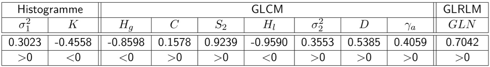
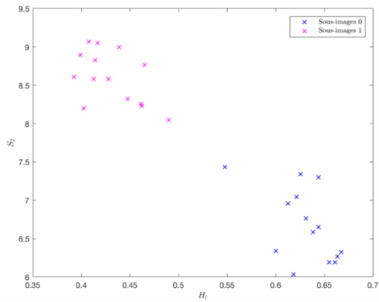
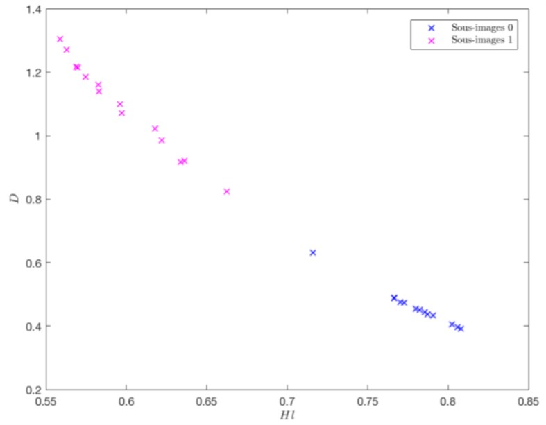

# Analysis of textures of CT Scan images for Tumor Detection
This project was undertaken as a first year project at CentraleSupélec. The authors of the code are Naman Sharma, Aurélien Lestienne and Thomas Andal.

CT Scan images are commonly used to discern potentially cancerous tissue. The cancerous tissue can usually be distingued from healthy tissue by eye. An example of a scan of tissue is shown below. The patch of cancerous tissue can be seen as well.

This project aims to aid in the process of scanning a large number of images to detect potentially cancerous tissue samples. This will be acomplished by using 1st and 2nd order statistics derived from the Gray Level Co-occurence Matrix (GLCM) and Gray-Level Run Length Matrix (GLRM) of the images. These statitics allow us to perform texture analysis on the images. For more information on GLCM, look [here](https://www.mathworks.com/help/images/texture-analysis-using-the-gray-level-co-occurence-matrix-glcm.html).

## Image Features:
The images went through the following stages of preprocessing: normalization, gaussian filtering and uniform quantification. After preprocessing, the following features were extracted:
1. From the image histogram: variance $\sigma^2_1$, Kurtosis $K$.
2. From GLCM: contrast $C$, autocorrelation $\gamma_a$, global homogeneity $H_g$, entropy $S_2$, local homogeneity $H_l$, variance $\sigma^2_2$, dissimilarity $D$
3. From GLRM: Gray level non uniformity $GLN$

##Results
The correlation of the output (healthy or cancerous) was calculated for the above features. The results are show below:

We see that the three features most correlated to the output are: local homogeneity, entropy and dissimilarity. ALl three of these features are calculated from the Gray Level Co-occurance Matrix (GLCM). This is becuase these features are very dependent on the local level texture changes in the image, which is exactly what we are looking for. Below, we show the distribution of the input images with respect to these features.

